# OWRS Analysis


```
## 
## Attaching package: 'dplyr'
```

```
## The following objects are masked from 'package:stats':
## 
##     filter, lag
```

```
## The following objects are masked from 'package:base':
## 
##     intersect, setdiff, setequal, union
```

```
## Loading required package: sp
```

```
## 
## Attaching package: 'raster'
```

```
## The following object is masked from 'package:dplyr':
## 
##     select
```

```
## 
## Attaching package: 'purrr'
```

```
## The following object is masked from 'package:scales':
## 
##     discard
```

```
## 
## Attaching package: 'lubridate'
```

```
## The following object is masked from 'package:base':
## 
##     date
```


```
## [1] 81
```

```
## Format error in file: Goleta Water District - 1215/04-01-2017.owrs 
##  Error in value[[3L]](cond): The following map keys are missing from the OWRS file: (3/4")
## 
```

```
## [1] 85
```

```
## Format error in file: Humboldt Bay Municipal Water District - 1370/07-01-2017.owrs 
##  Error in value[[3L]](cond): The following map keys are missing from the OWRS file: (3/4")
## 
```

```
## [1] 86
```

```
## Format error in file: Humboldt Community Services District - 1371/08-01-2017.owrs 
##  Error in value[[3L]](cond): The following map keys are missing from the OWRS file: (3/4")
## 
```

```
## [1] 110
```

```
## Format error in file: Mid-Peninsula Water District - 1827/07-01-2017.owrs 
##  Error in value[[3L]](cond): The following map keys are missing from the OWRS file: (3/4")
## 
```

```
## [1] 118
```

```
## Format error in file: North Marin Water District - 1996/06-01-2017.owrs 
##  Error in value[[3L]](cond): The following map keys are missing from the OWRS file: (3/4")
## 
```

```
## [1] 179
```

```
## Format error in file: Western Municipal Water District - 3150/01-01-2018.owrs 
##  Error in value[[3L]](cond): argument is of length zero
## 
```


```r
#The usage_ccf to evaluate for the histograms and bar chart
singleTargetValue <- 10;
```


```r
plot_bill_frequency_piechart(df_final_bill)
```

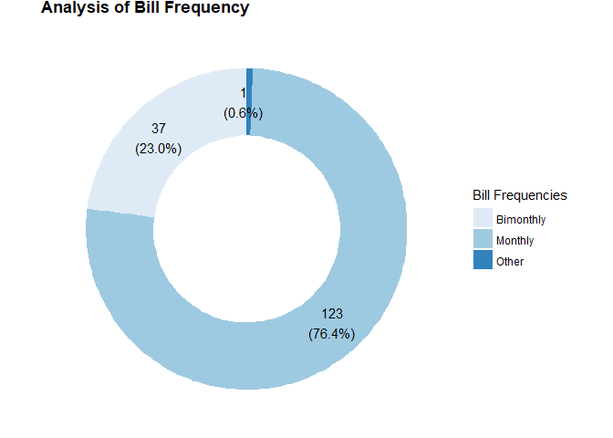<!-- -->


```r
plot_mean_bill_pie(df_final_bill, singleTargetValue)
```

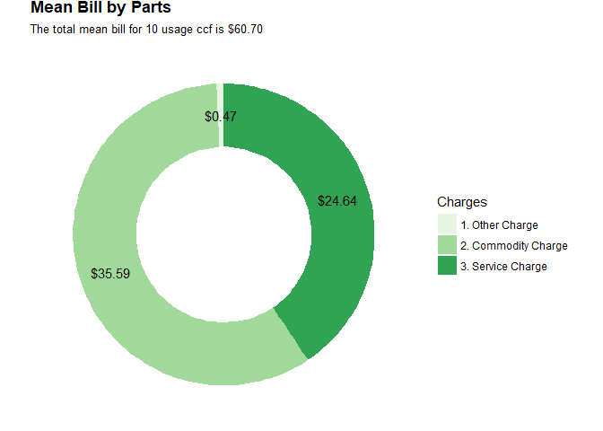<!-- -->


```r
plot_rate_type_pie(df_final_bill)
```

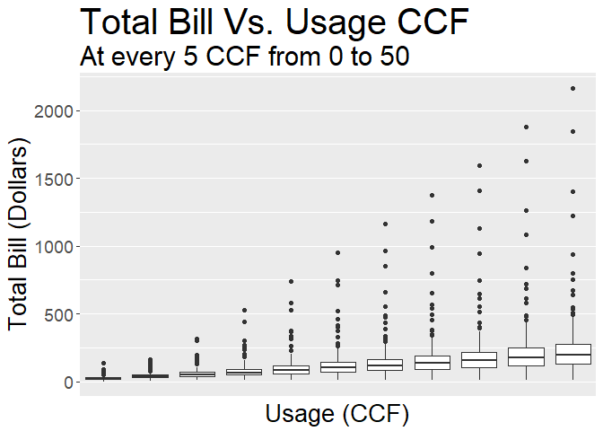<!-- -->


```r
plot_commodity_charges_vs_usage(df_final_bill, start, end, interval)
```

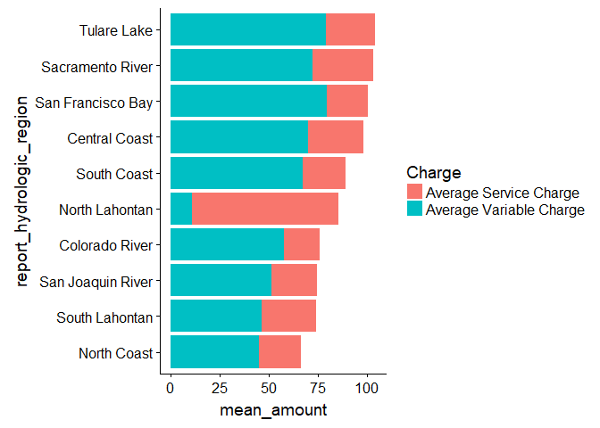<!-- -->


```r
plot_bills_vs_usage(df_final_bill, start, end, interval)
```

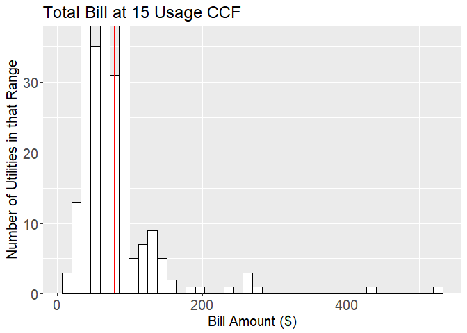<!-- -->


```r
# png(filename='plots/boxplot_bills.png',  width = 700, height = 432, units = "px")
# plot(boxplot_bills_vs_usage(df_final_bill, start, end, interval))
# dev.off()

boxplot_bills_vs_usage(df_final_bill, start, end, interval)
```

<!-- -->


meanpercentFixed <- round(mean(as.numeric(df_final_bill$percentFixed[df_final_bill$usage_ccf == singleTargetValue])), 3)


```r
plot_ratio_histogram(df_final_bill, singleTargetValue)
```

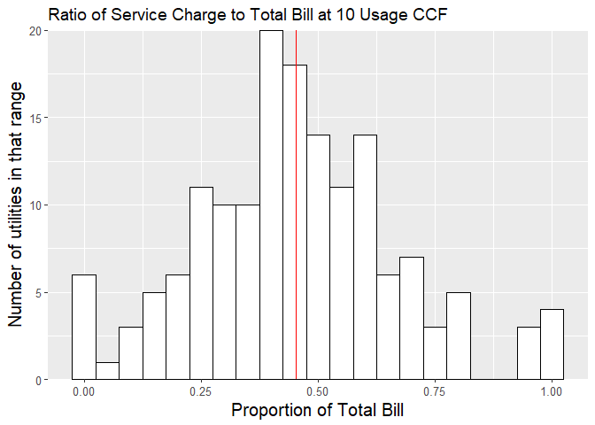<!-- -->


```r
plot_bill_histogram(df_final_bill, singleTargetValue)
```

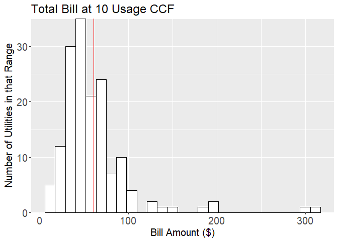<!-- -->

# Rates x Efficiency
## Define Period of Analysis

```r
startmonth <- 1
startyear <- 2017
endmonth <- 12
endyear <- 2017

startdate <- as.Date(paste('01', as.character(startmonth), as.character(startyear)), "%d %m %Y")
enddate <- as.Date(paste('01', as.character(endmonth), as.character(endyear)), "%d %m %Y")
reference_period <- seq.Date(startdate, enddate, by="month")
```
## Calculate Rates

```r
# Rates time series

df_usage <- as.data.frame(list("usage_ccf"=15, "cust_class"="RESIDENTIAL_SINGLE"))

df_adjustable_sample <- tbl_df(data.frame (reference_date = reference_period,
                                           usage_month = month(reference_period),
                                           usage_year = year(reference_period),
                                           days_in_period = days_in_month(reference_period),
                                           hhsize = 4, meter_size = '3/4"', usage_zone = 1, landscape_area = 2000,
                                           et_amount = 7.0, wrap_customer = "No", irr_area = 2000, 
                                           carw_customer = "No", season = "Winter", tax_exemption = "granted", 
                                           lot_size_group = 3, temperature_zone = "Medium", pressure_zone = 1, 
                                           water_font = "city_delivered", city_limits = "inside_city", 
                                           water_type = "potable", rate_class = "C1", dwelling_units = 10, 
                                           elevation_zone = 2, greater_than = "False", usage_indoor_budget_ccf = .3, 
                                           meter_type = "Turbine", block = 1, tariff_area = 1, turbine_meter = "No",
                                           senior = "no", cust_class = customer_classes[1]))

df_sample <-  left_join(df_usage, df_adjustable_sample, by="cust_class")

df_bill <- calculate_bills_for_all_utilities(df_OWRS, df_sample, owrs_path, customer_classes)
```

```
## [1] 81
```

```
## Format error in file: Goleta Water District - 1215/04-01-2017.owrs 
##  Error in value[[3L]](cond): The following map keys are missing from the OWRS file: (3/4")
## 
```

```
## [1] 85
```

```
## Format error in file: Humboldt Bay Municipal Water District - 1370/07-01-2017.owrs 
##  Error in value[[3L]](cond): The following map keys are missing from the OWRS file: (3/4")
## 
```

```
## [1] 86
```

```
## Format error in file: Humboldt Community Services District - 1371/08-01-2017.owrs 
##  Error in value[[3L]](cond): The following map keys are missing from the OWRS file: (3/4")
## 
```

```
## [1] 110
```

```
## Format error in file: Mid-Peninsula Water District - 1827/07-01-2017.owrs 
##  Error in value[[3L]](cond): The following map keys are missing from the OWRS file: (3/4")
## 
```

```
## [1] 118
```

```
## Format error in file: North Marin Water District - 1996/06-01-2017.owrs 
##  Error in value[[3L]](cond): The following map keys are missing from the OWRS file: (3/4")
## 
```

```
## [1] 179
```

```
## Format error in file: Western Municipal Water District - 3150/01-01-2018.owrs 
##  Error in value[[3L]](cond): argument is of length zero
## 
```

```r
#list of utilities for which the 3/4" key was not found to calculate the rates
#identified from the errors thrown when running this chunk of code.
meter_size_58 <- c('Goleta Water District',
                   'Humboldt Bay Municipal Water District', 
                   'Mid-Peninsula Water District', 
                   'North Marin Water District')

df_sample$meter_size <- '5/8"'

df_bill <- rbind(df_bill,
                 calculate_bills_for_all_utilities(df_OWRS[df_OWRS$utility_name %in% meter_size_58,], 
                                                   df_sample, owrs_path, customer_classes))
#same process for the utilities where the smallest meter size is 1 inch.
meter_size_1in <- c('Humboldt Community Services District')

df_sample$meter_size <- '1"'

df_bill <- rbind(df_bill,
                 calculate_bills_for_all_utilities(df_OWRS[df_OWRS$utility_name %in% meter_size_1in,], 
                                                   df_sample, owrs_path, customer_classes))

#Format the Bill Information so that only valid data entries are presented, 
#the decimal points are rounded, and the data is arranged by utility
df_final_bill <- tbl_df(df_bill) %>% filter(!is.na(bill)) %>%
  mutate(bill = round(as.numeric(bill), 2),
         commodity_charge = round(as.numeric(commodity_charge), 2),
         service_charge = round(service_charge, 2),
         utility_name = as.character(utility_name),
         bill_frequency = as.character(bill_frequency),
         usage_ccf = ifelse(unit_type=="kgal", 1.33681*usage_ccf, usage_ccf)) %>%
  filter(reference_date >= effective_date) %>% group_by(utility_name, reference_date) %>%
  filter(effective_date == max(effective_date)) %>%
  arrange(utility_name)

#getting rid of the annually charged bills until we fix the bill calculator
df_final_bill <- df_final_bill[which(df_final_bill$bill_frequency != "Annually"),]
```
Average water rates history:

```r
plot_avg_price_history(df_final_bill)
```

```
## Warning: Removed 60 rows containing non-finite values (stat_boxplot).
```

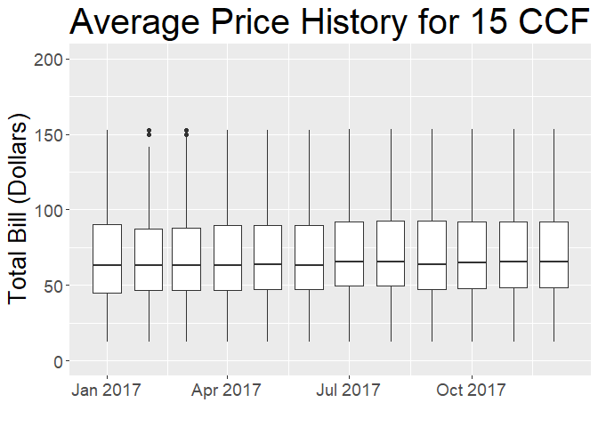<!-- -->


## Calculate Efficiency
Load suppliers report info and join with the Utilities list from the OWRS files

```r
#load supplier reports, geoinformation and pwsid_record
supplier_reports <- read.csv('data/supplier_report.csv', stringsAsFactors=FALSE)
#supplier_geo <- read.csv('data/suppliers.csv', stringsAsFactors=FALSE)
supplier_pwsid <- read.csv('data/utilities_for_OWRS.csv', stringsAsFactors=FALSE)


# append to df_OWRS the best fuzzy match for utility_name to get pwsid
# cutoff chosen arbitraily, other values can be tested
df_OWRS$fuzzy_match <- as.character(sapply(df_OWRS$utility_name, GetCloseMatches,
                              sequence_strings = supplier_pwsid$Agency_Name, n=1L, cutoff = 0.85))

# get pswid
merged_OWRS <- merge(df_OWRS, supplier_pwsid, by.x = "fuzzy_match", by.y = "Agency_Name", all.x=TRUE, all.y=FALSE)
# merge with suplier report
merged_OWRS <- merge(merged_OWRS, supplier_reports, by.x = "PWSID", by.y = "report_pwsid", all.x=TRUE, all.y=FALSE)
```
Calculate Efficiency from the suppliers reports

```r
#The standard value for GPCD is assumed 55
target_gpcd <- 55
ET_adj_factor <- 0.8
unit_conversion <- 0.62

merged_OWRS$production_target <- 55 * merged_OWRS$report_population * merged_OWRS$report_days_in_month +
  merged_OWRS$report_irr_area_sf * merged_OWRS$report_eto * ET_adj_factor * unit_conversion

merged_OWRS$residential_use <- merged_OWRS$report_production_calculated * merged_OWRS$report_percent_residential

merged_OWRS$pct_above_target <- (merged_OWRS$residential_use / merged_OWRS$production_target) - 1

merged_OWRS$report_monthyear <- as.Date(paste('01', as.character(merged_OWRS$report_month),
                                              as.character(merged_OWRS$report_year)), "%d %m %Y")
```


```r
plot_efficiency_ts(merged_OWRS)
```

```
## Warning: Removed 39 rows containing non-finite values (stat_boxplot).
```

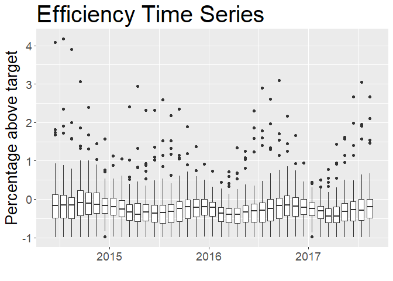<!-- -->


```r
plot_gpcd_ts(merged_OWRS)
```

```
## Warning: Removed 39 rows containing non-finite values (stat_boxplot).
```

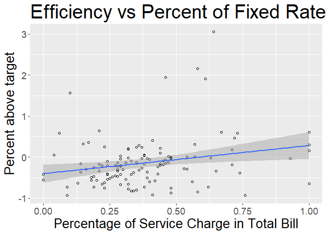<!-- -->
## Compare Rates and efficiency

```r
df_final_bill$fuzzy_match <- as.character(sapply(df_final_bill$utility_name, GetCloseMatches,
                              sequence_strings = supplier_pwsid$Agency_Name, n=1L, cutoff = 0.85))

df_final_bill <- merge(df_final_bill, supplier_pwsid, by.x = "fuzzy_match", by.y = "Agency_Name", all.x=TRUE, all.y=FALSE)


#merge on PWSID, month and Year
eff_vs_rate <- merge(df_final_bill, merged_OWRS, 
                     by.x = c("PWSID", "usage_month", "usage_year"),
                     by.y = c("PWSID", "report_month", "report_year"),
                     all.x=TRUE, all.y=FALSE)
```

Scatter plot of Efficiency (pct_above_target) vs Rates (Total Bill for 15 CCF)

```r
agg_eff_vs_rate <- eff_vs_rate[c("PWSID", "usage_month", "usage_year",
                                 "bill", "pct_above_target")] %>% na.omit() %>%
                        group_by(PWSID) %>% summarise_all(funs(mean))

plot_eff_vs_bill(agg_eff_vs_rate)
```

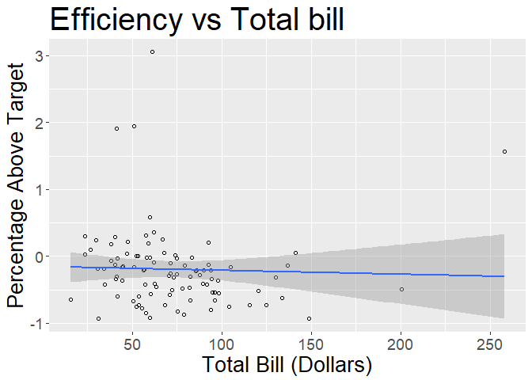<!-- -->

Scatter plot of Efficiency vs Rates Structure (% Fixed  - for 15 CCF)

```r
agg_eff_vs_rate <- eff_vs_rate[c("PWSID", "usage_month", "usage_year",
                                 "pct_above_target", "percentFixed")] %>% na.omit() %>%
                        group_by(PWSID) %>% summarise_all(funs(mean))

plot_eff_vs_pctFixed(agg_eff_vs_rate)
```

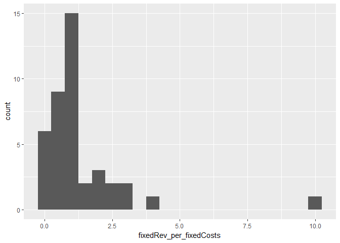<!-- -->

