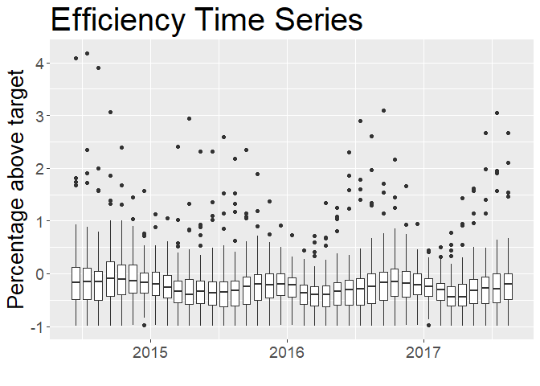
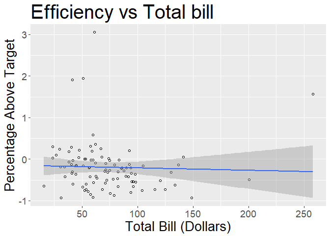
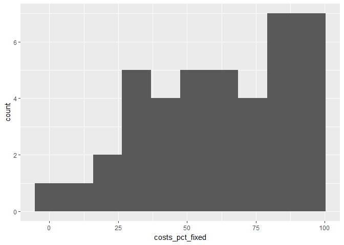

# California Water Rate Survey Results 2017


# Introduction

The [California Data Collaborative ("CaDC")](http://californiadatacollaborative.org/) is a coalition of water utilities that have pioneered a new data infrastructure non-profit 501 (c) (3) to support water managers in meeting their reliability objectives and serve the public good.

One important contribution of the CaDC was to establish a standard format and to provide the infrastructure for storage and maintainance of an open database for water rates, facilitating the work of analysts, economists and software developers interested in analyzing and understanding the differences in water rate structures and prices across many different agencies and locations. The water rate structures were organized in [Open-Water-Rate-Specification (OWRS)](https://github.com/California-Data-Collaborative/Open-Water-Rate-Specification) files, a format based on [YAML](http://yaml.org/), which is designed to be easy to store, transmit, and parse in any programming language while also being easy for humans to read.

This report presents a summary of the types of analyses and insights that can be obtained from analyzing the OWRS, especially when this information is combined with the water consumption data from water agencies and Census Data.

# Data

This report provides the combined analysis of data from 4 different sources:

* Water Rates from the [Open-Water-Rates-Specification](https://github.com/California-Data-Collaborative/Open-Water-Rate-Specification).
* Water Consumption data reported by the water agencies [ADD MORE DETAIL] 
* Demographic Data from the American Community Survey [??]
* Qualitative Data from a Survey realized by the California Data Collaborative with water agencies in 2017. 


# Summary Statistics

This section discusses general characteristics of the rates for utilities analyzed in this survey.


<!-- -->

<!-- -->


<!-- -->


<!-- -->

<!-- -->

# Rates x Efficiency
## Define Period of Analysis

## Calculate Rates

```
## [1] 81
```

```
## Format error in file: Goleta Water District - 1215/04-01-2017.owrs 
##  Error in value[[3L]](cond): The following map keys are missing from the OWRS file: (3/4")
## 
```

```
## [1] 85
```

```
## Format error in file: Humboldt Bay Municipal Water District - 1370/07-01-2017.owrs 
##  Error in value[[3L]](cond): The following map keys are missing from the OWRS file: (3/4")
## 
```

```
## [1] 86
```

```
## Format error in file: Humboldt Community Services District - 1371/08-01-2017.owrs 
##  Error in value[[3L]](cond): The following map keys are missing from the OWRS file: (3/4")
## 
```

```
## [1] 110
```

```
## Format error in file: Mid-Peninsula Water District - 1827/07-01-2017.owrs 
##  Error in value[[3L]](cond): The following map keys are missing from the OWRS file: (3/4")
## 
```

```
## [1] 118
```

```
## Format error in file: North Marin Water District - 1996/06-01-2017.owrs 
##  Error in value[[3L]](cond): The following map keys are missing from the OWRS file: (3/4")
## 
```

```
## [1] 179
```

```
## Format error in file: Western Municipal Water District - 3150/01-01-2018.owrs 
##  Error in value[[3L]](cond): argument is of length zero
## 
```
Average water rates history:


## Calculate Efficiency
Load suppliers report info and join with the Utilities list from the OWRS files

Calculate Efficiency from the suppliers reports


```
## Warning: Removed 39 rows containing non-finite values (stat_boxplot).
```

<!-- -->


```
## Warning: Removed 39 rows containing non-finite values (stat_boxplot).
```

<!-- -->
## Compare Rates and efficiency


Scatter plot of Efficiency (pct_above_target) vs Rates (Total Bill for 15 CCF)
<!-- -->

Scatter plot of Efficiency vs Rates Structure (% Fixed  - for 15 CCF)
<!-- -->

## Joining Data from the Qualitative Survey

```
## Warning: NAs introduced by coercion

## Warning: NAs introduced by coercion
```

```r
pct_costs <- ggplot(quali_survey, aes(costs_pct_fixed)) + geom_histogram(bins = 10)

pct_costs
```

```
## Warning: Removed 87 rows containing non-finite values (stat_bin).
```

<!-- -->


```r
pct_rev <- ggplot(quali_survey, aes(rev_pct_fixed)) + geom_histogram(bins = 10)

pct_rev
```

```
## Warning: Removed 83 rows containing non-finite values (stat_bin).
```

<!-- -->


```r
quali_survey$fixedRev_per_fixedCosts <- quali_survey$rev_pct_fixed / quali_survey$costs_pct_fixed

ggplot(quali_survey, aes(fixedRev_per_fixedCosts)) + geom_histogram(binwidth = 0.5)
```

```
## Warning: Removed 87 rows containing non-finite values (stat_bin).
```

<!-- -->


