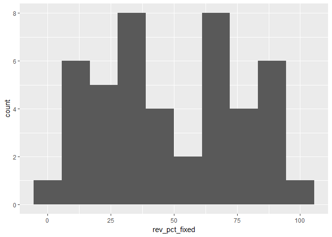
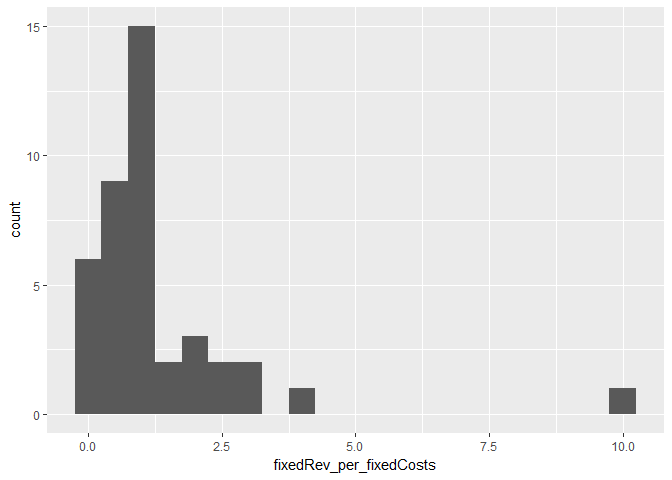

# California Water Rate Survey Results 2017


```
## 
## Attaching package: 'dplyr'
```

```
## The following objects are masked from 'package:stats':
## 
##     filter, lag
```

```
## The following objects are masked from 'package:base':
## 
##     intersect, setdiff, setequal, union
```

```
## Loading required package: sp
```

```
## 
## Attaching package: 'raster'
```

```
## The following object is masked from 'package:dplyr':
## 
##     select
```

```
## 
## Attaching package: 'purrr'
```

```
## The following object is masked from 'package:scales':
## 
##     discard
```

```
## 
## Attaching package: 'lubridate'
```

```
## The following object is masked from 'package:base':
## 
##     date
```

## Introduction

Background on the survey...


```
## [1] 81
```

```
## Format error in file: Goleta Water District - 1215/04-01-2017.owrs 
##  Error in value[[3L]](cond): The following map keys are missing from the OWRS file: (3/4")
## 
```

```
## [1] 85
```

```
## Format error in file: Humboldt Bay Municipal Water District - 1370/07-01-2017.owrs 
##  Error in value[[3L]](cond): The following map keys are missing from the OWRS file: (3/4")
## 
```

```
## [1] 86
```

```
## Format error in file: Humboldt Community Services District - 1371/08-01-2017.owrs 
##  Error in value[[3L]](cond): The following map keys are missing from the OWRS file: (3/4")
## 
```

```
## [1] 110
```

```
## Format error in file: Mid-Peninsula Water District - 1827/07-01-2017.owrs 
##  Error in value[[3L]](cond): The following map keys are missing from the OWRS file: (3/4")
## 
```

```
## [1] 118
```

```
## Format error in file: North Marin Water District - 1996/06-01-2017.owrs 
##  Error in value[[3L]](cond): The following map keys are missing from the OWRS file: (3/4")
## 
```

```
## [1] 179
```

```
## Format error in file: Western Municipal Water District - 3150/01-01-2018.owrs 
##  Error in value[[3L]](cond): argument is of length zero
## 
```


## Summary Statistics

This section discusses general characteristics of the rates for utilities analyzed in this survey.


<!-- -->

<!-- -->


<!-- -->

<!-- -->


<!-- -->


<!-- -->

<!-- -->

# Rates x Efficiency
## Define Period of Analysis

## Calculate Rates

```
## [1] 81
```

```
## Format error in file: Goleta Water District - 1215/04-01-2017.owrs 
##  Error in value[[3L]](cond): The following map keys are missing from the OWRS file: (3/4")
## 
```

```
## [1] 85
```

```
## Format error in file: Humboldt Bay Municipal Water District - 1370/07-01-2017.owrs 
##  Error in value[[3L]](cond): The following map keys are missing from the OWRS file: (3/4")
## 
```

```
## [1] 86
```

```
## Format error in file: Humboldt Community Services District - 1371/08-01-2017.owrs 
##  Error in value[[3L]](cond): The following map keys are missing from the OWRS file: (3/4")
## 
```

```
## [1] 110
```

```
## Format error in file: Mid-Peninsula Water District - 1827/07-01-2017.owrs 
##  Error in value[[3L]](cond): The following map keys are missing from the OWRS file: (3/4")
## 
```

```
## [1] 118
```

```
## Format error in file: North Marin Water District - 1996/06-01-2017.owrs 
##  Error in value[[3L]](cond): The following map keys are missing from the OWRS file: (3/4")
## 
```

```
## [1] 179
```

```
## Format error in file: Western Municipal Water District - 3150/01-01-2018.owrs 
##  Error in value[[3L]](cond): argument is of length zero
## 
```
Average water rates history:


## Calculate Efficiency
Load suppliers report info and join with the Utilities list from the OWRS files

Calculate Efficiency from the suppliers reports


```
## Warning: Removed 39 rows containing non-finite values (stat_boxplot).
```

<!-- -->


```
## Warning: Removed 39 rows containing non-finite values (stat_boxplot).
```

<!-- -->
## Compare Rates and efficiency


Scatter plot of Efficiency (pct_above_target) vs Rates (Total Bill for 15 CCF)
<!-- -->

Scatter plot of Efficiency vs Rates Structure (% Fixed  - for 15 CCF)
<!-- -->

## Joining Data from the Qualitative Survey

```
## Warning: NAs introduced by coercion

## Warning: NAs introduced by coercion
```

```r
pct_costs <- ggplot(quali_survey, aes(costs_pct_fixed)) + geom_histogram(bins = 10)

pct_costs
```

```
## Warning: Removed 87 rows containing non-finite values (stat_bin).
```

<!-- -->


```r
pct_rev <- ggplot(quali_survey, aes(rev_pct_fixed)) + geom_histogram(bins = 10)

pct_rev
```

```
## Warning: Removed 83 rows containing non-finite values (stat_bin).
```

<!-- -->


```r
quali_survey$fixedRev_per_fixedCosts <- quali_survey$rev_pct_fixed / quali_survey$costs_pct_fixed

ggplot(quali_survey, aes(fixedRev_per_fixedCosts)) + geom_histogram(binwidth = 0.5)
```

```
## Warning: Removed 87 rows containing non-finite values (stat_bin).
```

<!-- -->


