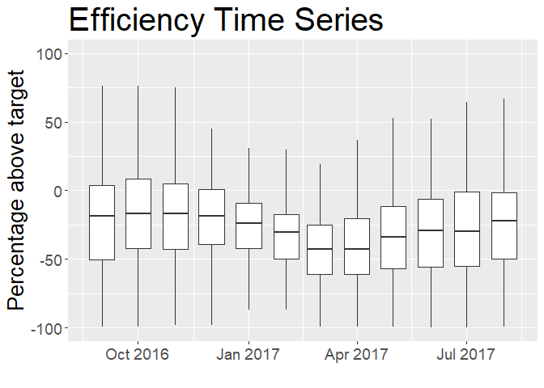

# California Water Rate Survey Results 2017

# Introduction

The [California Data Collaborative ("CaDC")](http://californiadatacollaborative.org/) is a coalition of water utilities that have pioneered a new data infrastructure non-profit 501 (c) (3) to support water managers in meeting their reliability objectives and serve the public good.

One important contribution of the CaDC was to establish a standard format and to provide the infrastructure for storage and maintainance of an open database for water rates, facilitating the work of analysts, economists and software developers interested in analyzing and understanding the differences in water rate structures and prices across many different agencies and locations. The water rate structures were organized in [Open-Water-Rate-Specification (OWRS)](https://github.com/California-Data-Collaborative/Open-Water-Rate-Specification) files, a format based on [YAML](http://yaml.org/), which is designed to be easy to store, transmit, and parse in any programming language while also being easy for humans to read.

This report presents a summary of the types of analyses and insights that can be obtained from analyzing the OWRS, especially when this information is combined with the water consumption data from water agencies and Census Data.

# Data

This report provides the combined analysis of data from 4 different sources:

* Water Rates from the [Open-Water-Rates-Specification](https://github.com/California-Data-Collaborative/Open-Water-Rate-Specification).
* Water Consumption data reported by the water agencies [ADD MORE DETAIL] 
* Demographic Data from the American Community Survey [??]
* Qualitative Data from a Survey realized by the California Data Collaborative with water agencies in 2017. 

# Summary Statistics

This section discusses general characteristics of the rates for utilities analyzed in this survey.

# Rates x Efficiency

This section provides an analysis of the relationships between the rates charged by each water agency and the efficiency in water use in the areas served by those agencies.

The period considered for the analysis is 1/2017 to 12/2017.

## Rates in the period

Average water rates history:

## Efficiency in the period
Load suppliers report info and join with the Utilities list from the OWRS files

## Comparing Rates and Efficiency

## Operational Costs and Revenue in the Water Agencies

