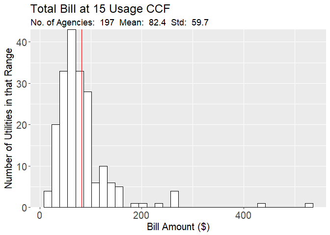
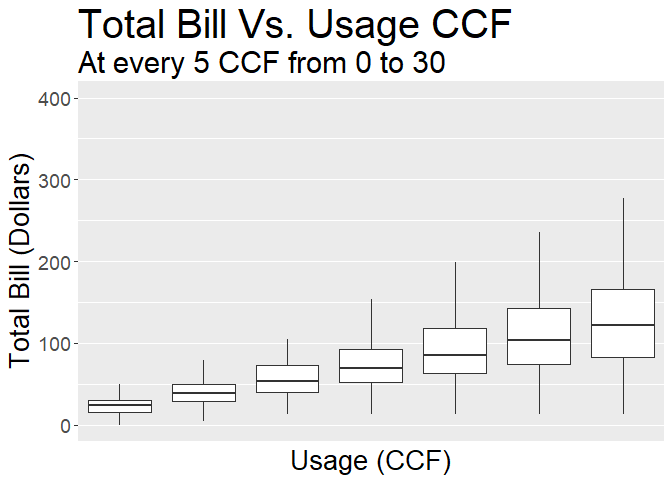
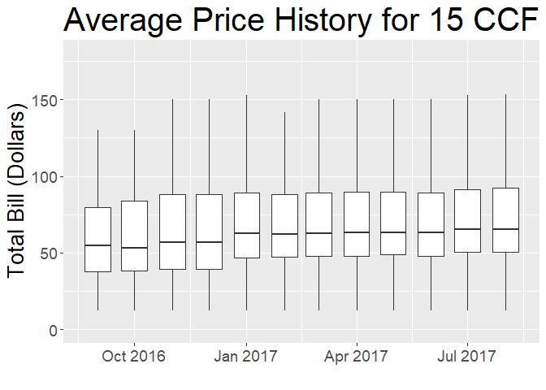
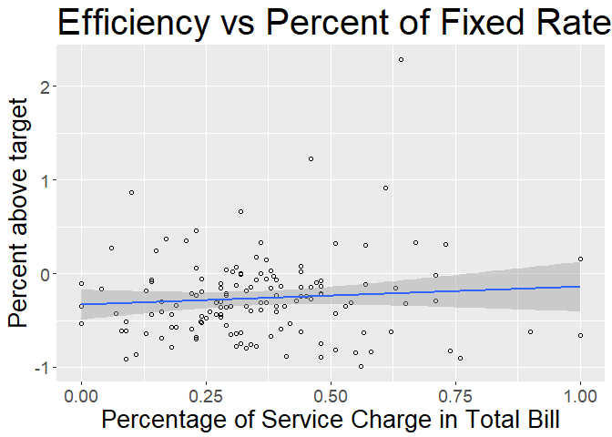
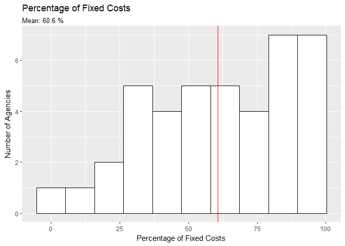

# California Water Rate Survey Results 2017

# Introduction

The [California Data Collaborative ("CaDC")](http://californiadatacollaborative.org/) is a coalition of water utilities that have pioneered a new data infrastructure non-profit 501 (c) (3) to support water managers in meeting their reliability objectives and serve the public good.

One important contribution of the CaDC was to establish a standard format and to provide the infrastructure for storage and maintainance of an open database for water rates, facilitating the work of analysts, economists and software developers interested in analyzing and understanding the differences in water rate structures and prices across many different agencies and locations. The water rate structures were organized in [Open-Water-Rate-Specification (OWRS)](https://github.com/California-Data-Collaborative/Open-Water-Rate-Specification) files, a format based on [YAML](http://yaml.org/), which is designed to be easy to store, transmit, and parse in any programming language while also being easy for humans to read.

This report presents a summary of the types of analyses and insights that can be obtained from analyzing the OWRS, especially when this information is combined with the water consumption data from water agencies and Census Data.

# Data

This report provides the combined analysis of data from 4 different sources:

* Water Rates from the [Open-Water-Rates-Specification](https://github.com/California-Data-Collaborative/Open-Water-Rate-Specification).
* Water Consumption data reported by the water agencies [ADD MORE DETAIL] 
* Demographic Data from the American Community Survey [??]
* Qualitative Data from a Survey realized by the California Data Collaborative with water agencies in 2017. 

# Rate Structures

This section discusses general characteristics of the rates for utilities analyzed in this survey.

Figure  1 above shows that 74.9% of the agencies charge their customers on a monthly basis.
That indicates an increase in relation to the previous survey (2015), showing that there seems to be trend in Agencies moving from a bi-monthly billing system to a monthly one. 

In terms of the different parts from a bill, Figure  2 shows that for a usage of 15 CCF the commodity charge portion from the bill is the biggest one representing on average 32.6% of the total bill.

From analyzing the different rate structures adopted by each agency, Figure  3 shows that most of the agencies(67.7%) adopt a tiered rate structure, but a significant amount still adopt an uniform rate structure (24.6%)

The histogram in Figure  5 shows the distribution and the mean of the ratio between the service charge and the total bill for each agency. That number is a good proxy for the proportion of revenue in each agency that is fixed and does not depend on the consumer's water usage.

Figure  6 shows an histogram of the different amounts charged by each agency for a water usage of 15 CCF in single family residential units.

Figure  7 ilustrates how the variability of the total water bill among agencies increases the higher the water usage by single residential units. It noteworthy that at a usage as low as 10 to 15 CCF there can be already a difference of two to three fold between agencies. 

# Relating Rates to Efficiency

This section provides an analysis of the relationships between the rates charged by each water agency and the efficiency in water use in the areas served by those agencies.

The period considered for the analysis is 9/2016 to 8/2017.

## Rates in the period

Figure  8 shows that the prices remained fairly stable throughout the year. Although there was a large variability across agencies the the total bill for 15 CCF of usage for about half of the agencies stayed in the interval between $50 and $80 for most of the year. 

## Efficiency in the period
Load suppliers report info and join with the Utilities list from the OWRS files

In terms of Efficiency Figure  9 shows a considerable seasonal variation and that even with that variation, most agencies have met theri efficiency goals throughout the whole period. 

## Rates vs Efficiency

Despite the large variance around the linear fit, Figure  10 does show a significant[* pearson? another statistical test?] negative correlation between the percentage above target and the total bill paid by residential customers in single-family units. 

Furthermore, Figure  11 shows a positive correlation [significant? pearson?] of Percentage of Service Charge and Percentage Above Target. Indicating that the more sensitive their bill is to the amount of water they consume, more efficient the customers tend to be.  

## Operational Costs and Revenue in the Water Agencies

In this year's survey, some water agencies indicated (as an optional response) how much of their revenue and how much of their costs come from fixed sources that do not depend on the amount of water usage in a given period. Figure  12 shows that on average, the water agencies that provided that information, have 61 % of their costs fixed, while 49 % of their revenue being fixed, as show in Figure  13.

In addition, when computing the ratio between the percentage of fixed revenue to percentage of fixed costs, Figure  13 shows that at least half of the agencies have their percentage of fixed revenue smaller than or equal to the percentage of fixed costs.
