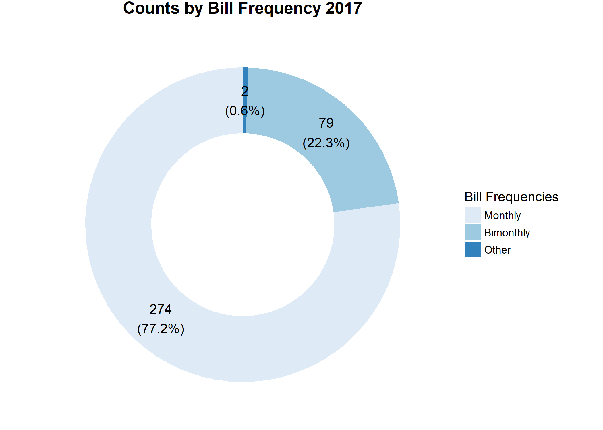
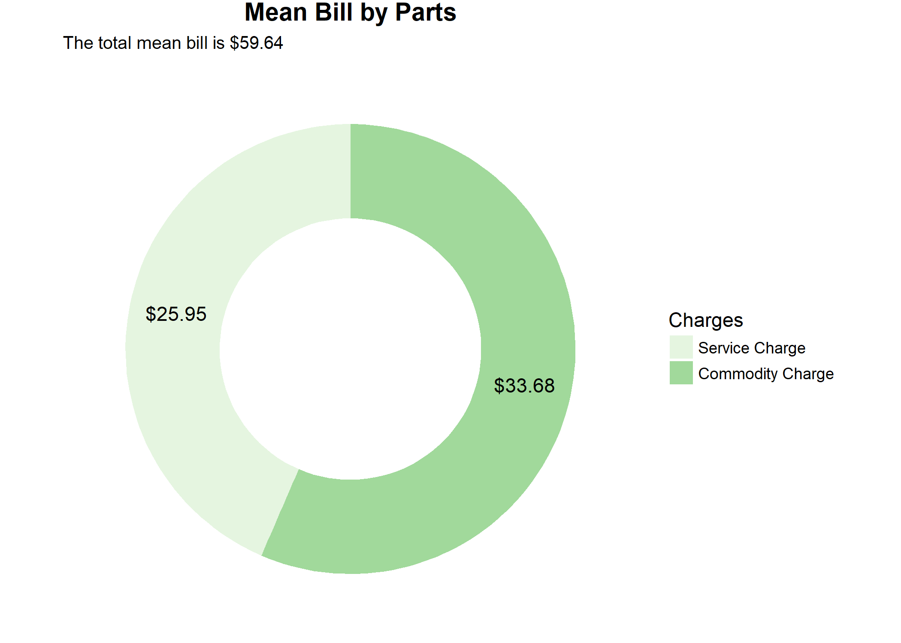
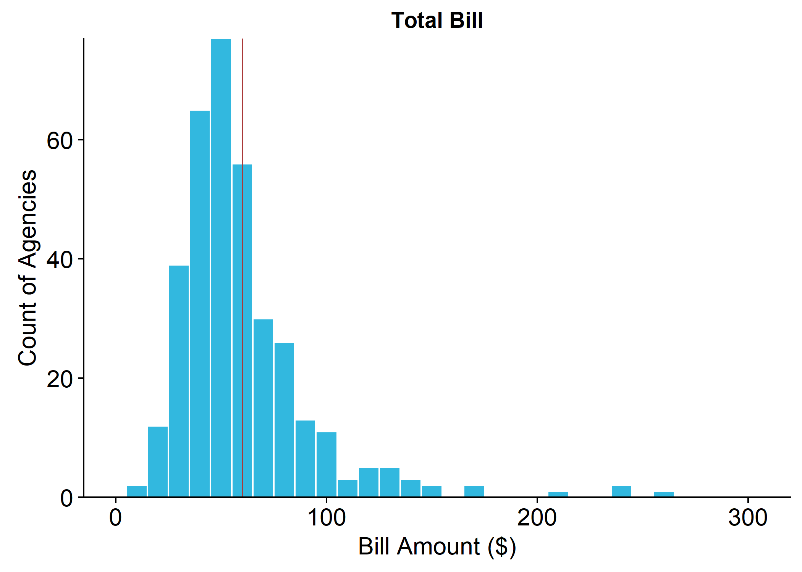
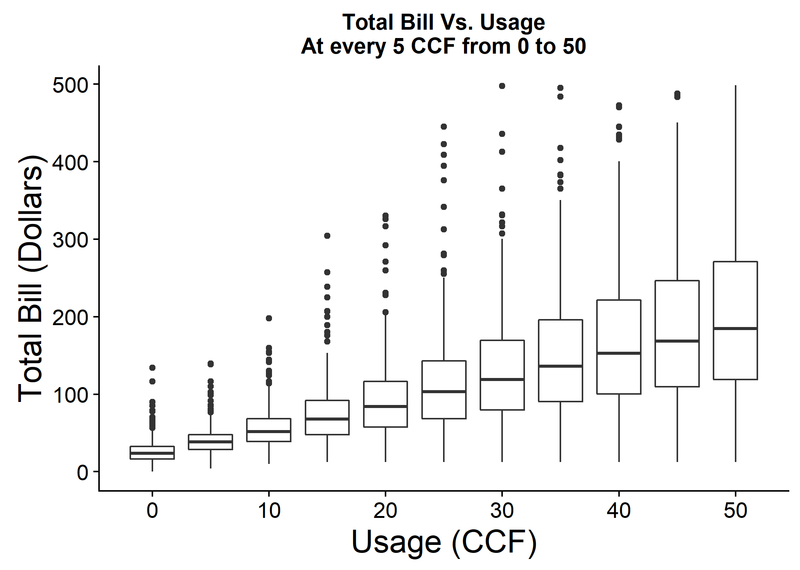
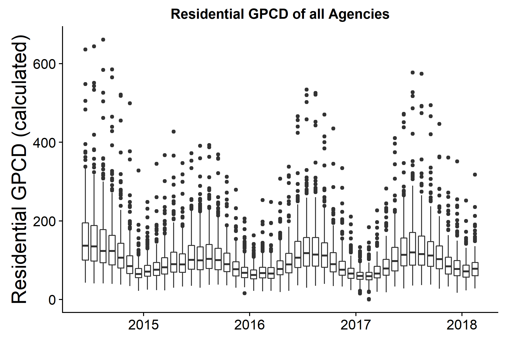
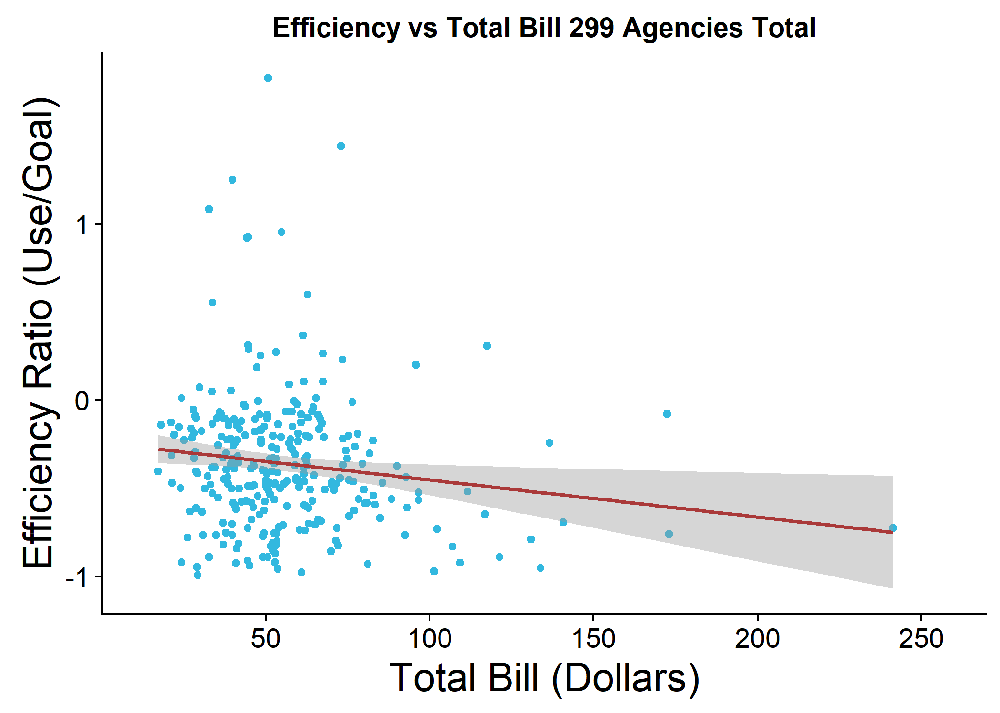
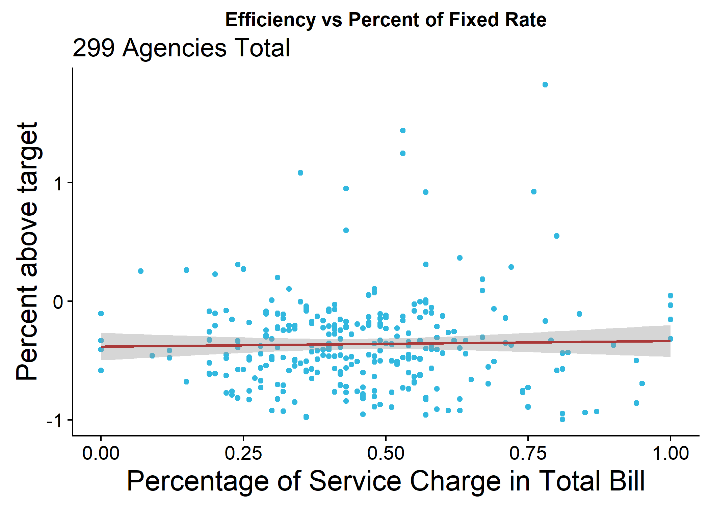
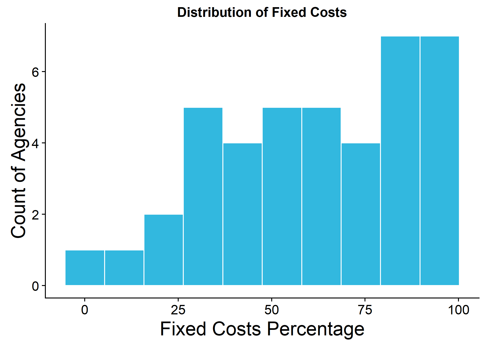
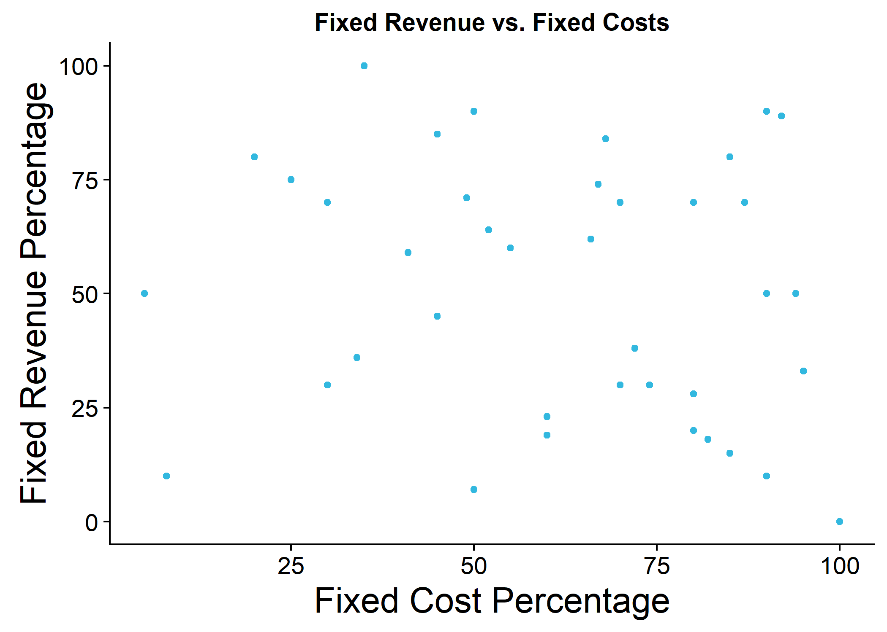

# Introduction

The [California Data Collaborative ("CaDC")](http://californiadatacollaborative.org/) is a coalition of water utilities that have pioneered a new data infrastructure non-profit 501 (c) (3) to support water managers in meeting their reliability objectives and serve the public good.

One important contribution of the CaDC was to establish a standard format and to provide the infrastructure for storage and maintainance of an open database for water rates, facilitating the work of analysts, economists and software developers interested in analyzing and understanding the differences in water rate structures and prices across many different agencies and locations. The water rate structures were organized in [Open-Water-Rate-Specification (OWRS)](https://github.com/California-Data-Collaborative/Open-Water-Rate-Specification) files, a format based on [YAML](http://yaml.org/), which is designed to be easy to store, transmit, and parse in any programming language while also being easy for humans to read.

This report presents a summary of the types of analyses and insights that can be obtained from analyzing the OWRS, especially when this information is combined with the water consumption data from water agencies and Census Data.

# Data

This report provides the combined analysis of data from 4 different sources:

* Water Rates from the [Open-Water-Rates-Specification](https://github.com/California-Data-Collaborative/Open-Water-Rate-Specification).
* Water Consumption data reported by the water agencies [ADD MORE DETAIL] 
* Demographic Data from the American Community Survey [??]
* Qualitative Data from a Survey realized by the California Data Collaborative with water agencies in 2017. 


```r
df_past_years$utility_name_raftelis <- sapply(df_past_years$Water.Service.Provider, preprocess_raftelis_name) 
df_past_years <- assign_fuzzy_match_names(df_past_years, 
                                          source_column_name = "utility_name_raftelis",
                                          new_name_column = "utility_name_owrs",
                                          names_to_match_with = df_final_bill_single$utility_name,
                                          manual_map = NULL,
                                          cutoff = 0.85)
```


# Summary Statistics

This section discusses general characteristics of the rates for utilities analyzed in this survey.

<div class="figure">

<p class="caption">Figure  1: Bill Frequency Pie Chart. About three quarters of the water agencies use a monthly billing system.</p>
</div>


<div class="figure">

<p class="caption">Figure  2: Average bill by parts for all agencies, considering a consumption of 10 CCF in a month. The average total bill is $60.68. With an average service charge (fixed) of $24.63 (40.6%) and an average commodity charge (variable) of $35.61 (58.7%).</p>
</div>




# Variation in Bills at Different Use Levels





# Interaction between Rates and Efficiency
## Define Period of Analysis
Average water rates history:


## Calculate Efficiency
Load suppliers report info and join with the Utilities list from the OWRS files



## Compare Rates and efficiency


Scatter plot of Efficiency (pct_above_target) vs Rates (Total Bill for 15 CCF)



## Joining Data from the Qualitative Survey


Scatter plot of Efficiency vs Rates Structure (% Fixed  - for 15 CCF)








